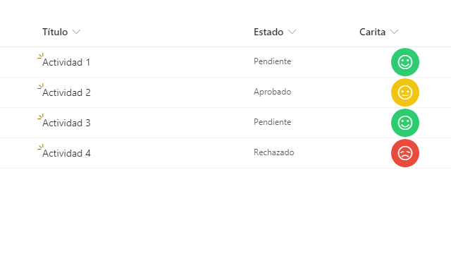

<h1>Formato de Columna</h1>
<h2>Caritas</h2>

<h3>Columnas Requeridas</h3>
<table>
    <thead>
        <tr>
            <td>Nombre</td>
            <td>Tipo</td>
        </tr>
    </thead>
    <tbody>
        <tr>
            <td>Title</td>
            <td>Una linea de texto</td>
        </tr>
        <tr>
            <td>Estado</td>
            <td>Elección</td>
        </tr>
        <tr>
            <td>Simbolo</td>
            <td>Una linea de texto</td>
        </tr>
    </body>
</table>